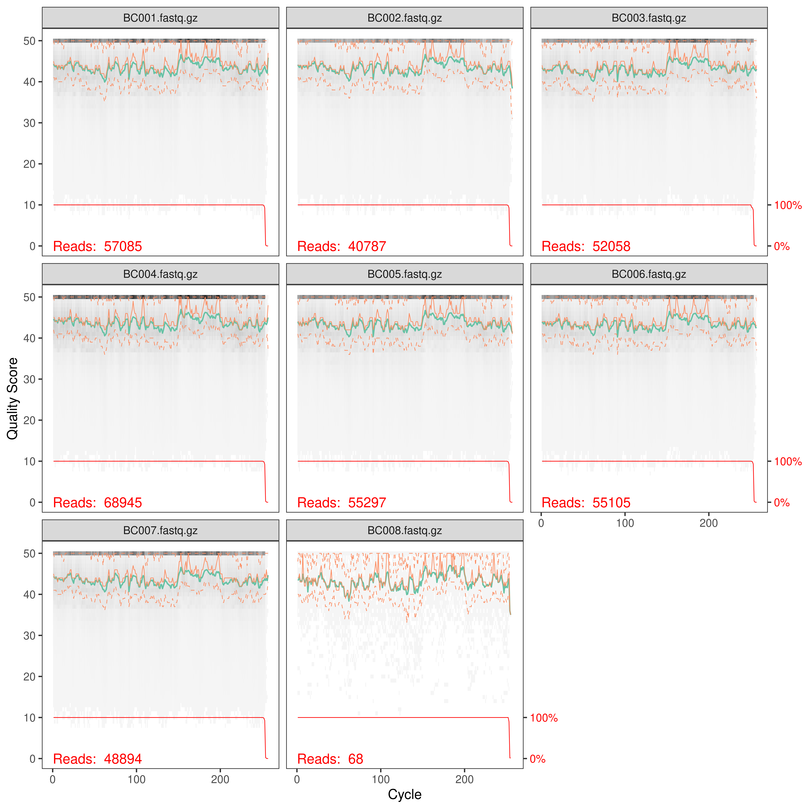
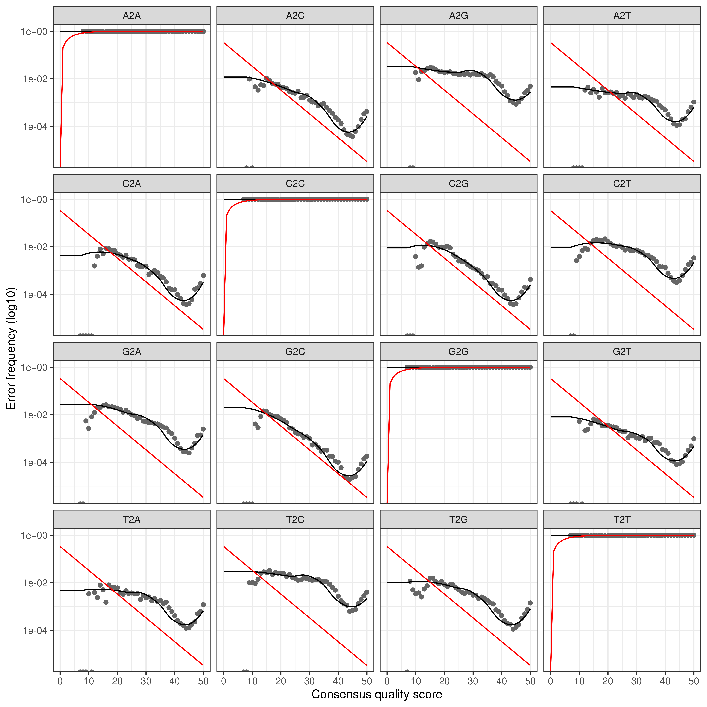
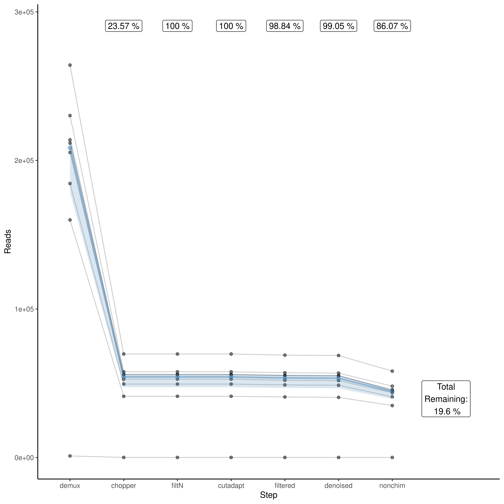

# dada2 tutorial with ONT MinION dataset for Fierer Lab

*This tutorial was made by Cliff Bueno de Mesquita based on the original
MiSeq dada2 tutorial created by Angela Oliverio and Hannah
Holland-Moritz. It is currently maintained by Cliff Bueno de Mesquita*  
*Updated December 11th, 2024*

This pipeline runs the dada2 workflow for Big Data (single-end) from
RStudio on the microbe server. This is for sequencing data from the ONT
MinION machine, not the Illumina MiSeq. For the MiSeq pipeline, see
<https://github.com/fiererlab/dada2_fiererlab>. In this pipeline, we
start with a fastq file from the MinION that has been basecalled with
super accurate basecalling. There are 8 samples (1 NTC and 7
replicates). We sequenced the known Zymo Community standard that
contains 8 bacterial species so we could make sure the output matched
the known community composition. For more information, see
<https://www.zymoresearch.com/collections/zymobiomics-microbial-community-standards/products/zymobiomics-microbial-community-standard>.
DO NOT use DADA2 if you did not perform super accurate basecalling, as
the error rate will be too high. We will first use cutadapt to trim
outer adapters and reorient the reads so they are in the same direction.
Then we will use dorado to demultiplex the the reads into their separate
samples using barcodes.

We suggest opening the dada2 tutorial online to understand more about
each step. The original pipeline on which this tutorial is based can be
found here: <https://benjjneb.github.io/dada2/bigdata_paired.html>

| <span>                                                                                                                                                                                                                                                       |
|:-------------------------------------------------------------------------------------------------------------------------------------------------------------------------------------------------------------------------------------------------------------|
| **NOTE:** There is a slightly different pipeline for ITS and non-“Big data” workflows. The non-“Big data” pipeline, in particular, has very nice detailed explanations for each step and can be found here: <https://benjjneb.github.io/dada2/tutorial.html> |
| <span>                                                                                                                                                                                                                                                       |

## Preliminary Checklist (part 0) - Before You Begin

1.  Check to make sure you know what your target ‘AMPLICON’ length is.
    This can vary between primer sets, as well as WITHIN primer sets.
    For example, ITS (internal transcribed spacer) amplicons can vary
    from \~100 bps to 300 bps.

    For examples regarding commonly used primer sets (515f/806r, Fungal
    ITS2, 1391f/EukBr) see protocols on the Earth Microbiome Project
    website: <https://earthmicrobiome.org/protocols-and-standards/>

2.  Check to make sure you know how long your reads should be (i.e., how
    long should the reads be coming off the sequencer?) This is not the
    same as fragment length, as many times, especially with longer
    fragments, the entire fragment is not being sequenced in one
    direction. When long *amplicons* are not sequenced with a *read
    length* that allows for substantial overlap between the forward and
    reverse read, you can potentially insert biases into the data. If
    you intend to merge your paired end reads, ensure that your read
    length is appropriate. For example, with a MiSeq 2 x 150, 300 cycle
    kit, you will get bidirectional reads of 150 base pairs.

3.  Make note of which sequencing platform was used, as this can impact
    both read quality and downstream analysis.

4.  Decide which database is best suited for your analysis needs. Note
    that DADA2 requires databases be in a custom format! If a custom
    database is required, further formatting will be needed to ensure
    that it can run correctly in dada2.

    See the following link for details regarding database formatting:
    <https://benjjneb.github.io/dada2/training.html#formatting-custom-databases>

5.  For additional tutorials and reporting issues, please see link
    below:  
    dada2 tutorial: <https://benjjneb.github.io/dada2/tutorial.html>  
    dada2 pipeline issues\*:
    <https://github.com/fiererlab/dada2_ONT/issues>

    \*Note by default, only ‘OPEN’ issues are shown. You can look at all
    issues by removing “is:open” in the search bar at the top.

## Set up (part 1) - Steps before starting pipeline

If you are running it through Fierer Lab “microbe” server:

#### Logging in:

To use the microbe server, open a terminal window, and type and hit
return:

``` bash
ssh <your microbe user name>@microbe.colorado.edu 
```

#### For your first time:

*Setting up your password:*

When you log in for the first time, you will have to set a new password.
First, log in using your temporary password. The command prompt will
then ask you to write a new password. Type it in once and hit return,
then type it in again to verify. When you set a new password, make sure
that it is something secure (i.e. has at least letters and numbers in
it). Note, nothing will show up on the screen when you enter passwords.

Important: DO NOT give out your password to anyone!

#### Downloading this tutorial from github

Once you have logged in, you can download a copy of the tutorial into
your directory on the server. To retrieve the folder with this tutorial
from github directly to the server, type the following into your
terminal and hit return after each line.

``` bash
wget https://github.com/fiererlab/dada2_fiererlab/archive/master.zip
unzip master.zip
```

If there are ever updates to the tutorial on github, you can update the
contents of this folder by downloading the new version from the same
link as above.

#### Login to RStudio on the server

1.  Open a your web browser and start a new empty tab
2.  Type `microbe.colorado.edu:8787` in the address bar
3.  Use your server login credentials to log into rstudio server

If you are running it on your own computer (runs slower!):

1.  Download this tutorial from github. Go to [the
    homepage](https://github.com/fiererlab/dada2_ONT), and click the
    green “Clone or download” button. Then click “Download ZIP”, to save
    it to your computer. Unzip the file to access the R-script.
2.  Download the tutorial data from here
    <http://cme.colorado.edu/projects/bioinformatics-tutorials>
3.  Install dorado, NanoPlot, cutadapt, chopper.
    - dorado can be downloaded from
      <https://github.com/nanoporetech/dorado>
    - NanoPlot can be installed with pip (pip install NanoPlot)
    - chopper can be installed with conda (conda create -n chopper_env
      -c bioconda chopper)
    - cutadapt can be installed with conda (conda create -n cutadapt_env
      -c bioconda cutadapt)
4.  Download the dada2-formatted reference database of your choice. Link
    to download here: <https://benjjneb.github.io/dada2/training.html>

## Set up (part 2) - You are logged in to Rstudio on server (or have it open on your computer)

First open the R script in Rstudio. The R script is located in the
tutorial folder you downloaded in the first step. You can navigate to
the proper folder in Rstudio by clicking on the files tab and navigating
to the location where you downloaded the github folder. Then click
dada2_fiererlab and dada2_tutorial_16S.R to open the R script.

Now, install DADA2 & other necessary packages. If this is your first
time on Rstudio server, when you install a package you might get a
prompt asking if you want to create your own library. Answer ‘yes’ twice
in the console to continue.

| <span>                                                                                                                  |
|:------------------------------------------------------------------------------------------------------------------------|
| **WARNING:** This installation may take a long time, so only run this code if these packages are not already installed! |
| <span>                                                                                                                  |

``` r
install.packages("BiocManager")
BiocManager::install("dada2")
BiocManager::install("ShortRead")

install.packages("dplyr")
install.packages("tidyr")
install.packages("Hmisc")
install.packages("ggplot2")
install.packages("plotly")
install.packages("rlang")
install.packages("R.utils")
install.packages("tibble")
install.packages("microseq")
install.packages("readxl")
install.packages("writexl")
```

Load DADA2 and required packages

``` r
library(dada2); packageVersion("dada2") # the dada2 pipeline
## [1] '1.32.0'
library(ShortRead); packageVersion("ShortRead") # dada2 depends on this
## [1] '1.62.0'
library(dplyr); packageVersion("dplyr") # for manipulating data
## [1] '1.1.4'
library(tidyr); packageVersion("tidyr") # for creating the final graph at the end of the pipeline
## [1] '1.3.1'
library(Hmisc); packageVersion("Hmisc") # for creating the final graph at the end of the pipeline
## [1] '5.1.3'
library(ggplot2); packageVersion("ggplot2") # for creating the final graph at the end of the pipeline
## [1] '3.5.1'
library(plotly); packageVersion("plotly") # for interactive graphs, helpful for quality plots
## [1] '4.10.4'
library(rlang); packageVersion("rlang") # for set_names() function
## [1] '1.1.4'
library(R.utils); packageVersion("R.utils") # for gzip
## [1] '2.12.3'
library(tibble); packageVersion("tibble") # for row names
## [1] '3.2.1'
library(microseq); packageVersion("microseq") # for writing fasta files
## [1] '2.1.6'
library(readxl); packageVersion("readxl") # for reading .xlsx files
## [1] '1.4.3'
library(writexl); packageVersion("writexl") # for writing .xlsx files
## [1] '1.5.1'
```

Once the packages are installed, you can check to make sure the
auxiliary software is working and set up some of the variables that you
will need along the way.

| <span>                                                                                                                                                      |
|:------------------------------------------------------------------------------------------------------------------------------------------------------------|
| **NOTE:** If you are not working from microbe server, you will need to change the file paths for cutadapt to where they are stored on your computer/server. |
| <span>                                                                                                                                                      |

For this tutorial we will be working with 16S amplicons from the Zymo
community standard, sequenced on an ONT MinION. We use the same library
prep as the EMP 16S protocol typically used for MiSeq sequencing. The
data are not paired so we will process them as if it’s a single end
forward read. The data for these samples can be found on the CME
website. <http://cme.colorado.edu/projects/bioinformatics-tutorials>

``` r
# Set up pathway to dorado (demultiplexing tool) and test
# If you don't know the path, in the terminal run "which NanoPlot"
dorado <- "/data/cliffb/dorado-0.8.2-linux-x64/bin/dorado" # CHANGE ME to your path
system2(dorado, args = "--version") # Check by running shell command from R

# Set up pathway to NanoPlot (QC tool) and test
# If you don't know the path, in the terminal run "which NanoPlot"
NanoPlot <- "/data/cliffb/miniforge3/bin/NanoPlot" # CHANGE ME to your path
system2(NanoPlot, args = "--version") # Check by running shell command from R

# Set up pathway to chopper (read length and quality filter tool) and test
# If you don't know the path, in the terminal run "conda activate chopper_env" then "which chopper"
chopper <- "/data/cliffb/miniforge3/envs/chopper_env/bin/chopper" # CHANGE ME to your path
system2(chopper, args = "--version")

# Set up pathway to cutadapt (primer trimming tool) and test
# If you don't know the path, in the terminal run "conda activate cutadapt_env" then "which cutadapt"
# This pipeline was developed with cutadapt 4.9
cutadapt <- "/data/cliffb/miniforge3/envs/cutadapt_env/bin/cutadapt" # CHANGE ME to your path
system2(cutadapt, args = "--version") # Check by running shell command from R

# Set path to the input data, in this case a fastq of super accurate basecalls
data.fp <- "/data/shared/Nanopore/Zymo_positive_control_10_28_2024/no_sample_id/20241028_1235_MN47817_FAZ82726_9877d59a/sup_calls.fastq.gz"
```

Set up file paths in YOUR directory where you want data; you do not need
to create the subdirectories but they are nice to have for
organizational purposes.

``` r
project.fp <- "/data/cliffb/ONT_tutorial" # CHANGE ME to project directory; don't append with a "/"
if (!dir.exists(project.fp)) dir.create(project.fp)

# Set up names of sub directories to stay organized
Qstart.fp <- file.path(project.fp, "Qstart") # NanoPlot files, start
Qchopper.fp <- file.path(project.fp, "Qchopper") # NanoPlot files, chopper
QfiltN.fp <- file.path(project.fp, "QfiltN") # NanoPlot files, filtN
Qcut.fp <- file.path(project.fp, "Qcut") # NanoPlot files, cutadapt primer trim
Qfiltered.fp <- file.path(project.fp, "Qfiltered") # NanoPlot files, final filter and trim
preprocess.fp <- file.path(project.fp, "01_preprocess")
    reorient.fp <- file.path(preprocess.fp, "reorient")
    demux.fp <- file.path(preprocess.fp, "demux")
    chopper.fp <- file.path(preprocess.fp, "chopper")
    filtN.fp <- file.path(preprocess.fp, "filtN")
    trimmed.fp <- file.path(preprocess.fp, "trimmed")
    trimmed2.fp <- file.path(preprocess.fp, "trimmed2")
    trimmed3.fp <- file.path(preprocess.fp, "trimmed3") # Might have to run cutadapt 3x to get everything
filter.fp <- file.path(project.fp, "02_filter") 
table.fp <- file.path(project.fp, "03_tabletax") 
```

## Pre-processing data for dada2 - reorient reads and trim outer adapters with cutadapt, demultiplex with dorado, filter by read length and minimum Q score with chopper, remove sequences with Ns with DADA2, trim primers with cutadapt

#### Check starting quality

``` r
# Before we even begin, let's check the quality and read length distributions of our starting data
# If it is taking a long time to run, you can increase the number of cores (-t argument)
# By default we are using 8 cores
args <- c("-t", "8", "--fastq", data.fp, "-o", Qstart.fp, "--no_static", "--plots", "dot")
system2(NanoPlot, args = args)
stats_start <- read.delim(paste0(Qstart.fp, "/NanoStats.txt"))
head(stats_start, n = 8)
##                            General.summary.
## 1 Mean read length:                   492.6
## 2 Mean read quality:                   14.9
## 3 Median read length:                 421.0
## 4 Median read quality:                 16.4
## 5 Number of reads:              2,066,815.0
## 6 Read length N50:                    428.0
## 7 STDEV read length:                3,450.4
## 8 Total bases:              1,018,165,033.0

# You may also want to scp that directory to your computer to look at the output plots
# LengthvsQualityScatterPlot_dot.html gives a nice overview of the read lengths and quality score distributions
# We'll be making these at each step of preprocessing so you can check how it changes
# We check the NanoStats.txt output to see mean length, mean quality, total reads
```

#### Reorient reads and trim outer adapters

The reads coming off of the MinION are not all oriented the same way.
We’ll first reorient the reads, and then demultiplex them. We can
reorient the reads using cutadapt and our knowledge of the adapter
constructs. For 16S, 18S, and ITS, the information is on the Earth
Microbiome Project site
<https://earthmicrobiome.org/protocols-and-standards/>.

Note: All reads are retained with this particular command, but you can
see from the verbose cutadapt program output how many reads actually had
the adapter constructs. Keep that in mind because probably only reads
with the adapter constructs will be able to be demultiplexed.

``` r
# Get the input files
fnF <- data.fp

# Make the output directory and paths
if (!dir.exists(preprocess.fp)) dir.create(preprocess.fp)
if (!dir.exists(reorient.fp)) dir.create(reorient.fp)
fnF.reorient <- file.path(reorient.fp, basename(fnF))

# Use the construct information and cutadapt to reorient reads to the same direction and trim the outer adapters
# These are 16S Illumina constructs from the EMP website
# The first sequence is N for barcode, then forward primer pad, linker, and primer
# The second sequence is the reverse complement of the reverse primer pad, linker, and primer
# min_overlap is set to the exact number of bases in the construct
# Run cutadapt on the super accurate basecalling fastq file
# This is tricky because we need a single quote around this -g argument, so make separately
adapter <- paste0(
  "'",
  "NNNNNNNNNNNNTATGGTAATTGTGTGYCAGCMGCCGCGGTAA;min_overlap=43...ATTAGAWACCCBNGTAGTCCGGCTGGCTGACT;min_overlap=32",
  "'"
)
R1.flags <- paste("-g", 
                  adapter,
                  "-e", 0.2) # Allow 0.2 error rate
system2(cutadapt, args = c(R1.flags, 
                           "--action=retain",
                           "--buffer-size=1000000000",
                           "--cores=16", # Use 16 cores for speed
                           "--revcomp", 
                           "-o", fnF.reorient, # Output 
                           fnF)) # Input
```

#### Demultiplex reads

Use dorado to match barcodes and make separate files for each sample.
First we will need to take the list of barcodes and sample IDs and turn
it into a fasta file. We will make a list of generic names BC001, BC002
etc. and write another mapping file for how those map to the original
sample IDs. Then you’ll need to make or adjust the arrangement .toml
file according to the settings you want and how many barcodes you have.
Then, run dorado.

``` r
# Function for making the files
make_demux_files <- function(file) {
  mf <- readxl::read_xlsx(file, sheet = 1, col_names = FALSE) %>%
    rlang::set_names(c("Sequence", "sampleID")) %>%
    dplyr::mutate(barcodeID = sprintf("BC%03d", seq_along(1:nrow(.))))
  fa <- mf %>%
    dplyr::select(barcodeID, Sequence) %>%
    dplyr::rename(Header = barcodeID)
  microseq::writeFasta(fa, paste0(project.fp, "/barcodes.fasta"))
  writexl::write_xlsx(mf, paste0(project.fp, "/barcode_map.xlsx"), format_headers = F)
}

# Make barcodes.fasta and barcodes_map.xlsx
# mapping file path - Replace me with your barcode/sample ID mapping file path!
file <- "/data/shared/Nanopore/Zymo_positive_control_10_28_2024/11.01.2024_PositiveControl_MappingFile.xlsx"
make_demux_files(file = file)

# Make your .toml arrangements file, put it on microbe (probably project.fp), and save the file path
toml.fp <- paste0(project.fp, "/barcode_arrangement.toml")

# Save the barcodes.fasta file path
barcodes.fp <- paste0(project.fp, "/barcodes.fasta")

# Set flags and run dorado
dorado.flags <- paste("demux", # demux function
                      fnF.reorient, # Input
                      "--output-dir", demux.fp, # Output
                      "--threads", 16, # Number of threads. Increase for speed.
                      "--verbose", # Print progress
                      "--emit-fastq", # Output as fastq
                      "--no-trim", # Don't trim the barcodes. We'll do that later
                      "--barcode-arrangement", toml.fp, # Parameters
                      "--barcode-sequences", barcodes.fp) # Fasta with barcodes
system2(dorado, args = dorado.flags)
```

``` r
### Clean up demux files
demux_files <- list.files(demux.fp)

# Delete the unclassified reads (should be the last file)
unlink(paste0(demux.fp, "/", demux_files[length(demux_files)]), recursive = TRUE)

# Trim and adjust the file names to match the barcode_map.xlsx names
demux_files <- list.files(demux.fp)
demux_rename <- substr(demux_files,
                       start = nchar(demux_files) - 15,
                       stop = nchar(demux_files))
demux_rename <- gsub(pattern = "barcode",
                     replacement = "BC",
                     x = demux_rename)

# Rename
file.rename(from = list.files(demux.fp, full.names = TRUE),
            to = paste0(demux.fp, "/", demux_rename))
## [1] TRUE TRUE TRUE TRUE TRUE TRUE TRUE TRUE

# Check
list.files(demux.fp)
## [1] "BC001.fastq" "BC002.fastq" "BC003.fastq" "BC004.fastq" "BC005.fastq"
## [6] "BC006.fastq" "BC007.fastq" "BC008.fastq"

# Gzip these to save space
system2("gzip", list.files(demux.fp, full.names = TRUE))

# Now save file objects for downstream steps.
fnFs <- sort(list.files(demux.fp, pattern=".fastq.gz", full.names = TRUE))
```

#### Pre-filter to a length range and minimum average quality, remove reads with Ns

MinION reads have some lower quality reads that we should filter
immediately as they will make it hard for cutadapt to find primers.
There also may be some reads that are way too short or way to long. You
can base the read length range you use on the output from the NanoPlot
read length distributions. You can adjust the minimum quality score
based on how stringent you want to be versus how many reads you want to
get through. However, we recommend a minimum of Q21 for 250 bp amplicons
so that at least 10% of the reads are error free. You will have to be
even more stringent the longer the reads are. See here for more
information. <https://github.com/benjjneb/dada2/issues/759>. Let’s
implement this with chopper. Here we will use Q30, min 250 and max 400,
but those can be changed depending on your data.

``` r
# Make directory
if (!dir.exists(chopper.fp)) dir.create(chopper.fp)

# Name the chopper'd files to put them in chopper/ subdirectory
fnFs.chopper <- file.path(preprocess.fp, "chopper", basename(fnFs))
fnFs.chopper <- gsub(".gz", "", fnFs.chopper) # Output is unzipped

for (i in seq_along(fnFs)) {
  system2(chopper, 
          args = c("-i", fnFs[i], # Input
                   "-t", 8, # Threads. Increase for speed.
                   "-q", 30, # Minimum quality score
                   "--minlength", 250, # Minimum read length
                   "--maxlength", 400), # Maximum read length
          stdout = fnFs.chopper[i]) # Output
}

# Now recompress the files with gzip
list.files(chopper.fp)
## [1] "BC001.fastq" "BC002.fastq" "BC003.fastq" "BC004.fastq" "BC005.fastq"
## [6] "BC006.fastq" "BC007.fastq" "BC008.fastq"
for (i in seq_along(fnFs)) {
  gzip(filename = fnFs.chopper[i],
       destname = paste0(fnFs.chopper[i], ".gz"))
}
list.files(chopper.fp)
## [1] "BC001.fastq.gz" "BC002.fastq.gz" "BC003.fastq.gz" "BC004.fastq.gz"
## [5] "BC005.fastq.gz" "BC006.fastq.gz" "BC007.fastq.gz" "BC008.fastq.gz"

# Remake names for next step
fnFs.chopper <- file.path(preprocess.fp, "chopper", basename(fnFs))

# Now check mean Q score
args <- c("-t", "8", "--fastq", paste0(chopper.fp, "/*.fastq.gz"), "-o", Qchopper.fp, "--no_static", "--plots", "dot")
system2(NanoPlot, args = args)
stats_chopper <- read.delim(paste0(Qchopper.fp, "/NanoStats.txt"))
head(stats_chopper, n = 8)
##                           General.summary.
## 1 Mean read length:                  327.8
## 2 Mean read quality:                  34.0
## 3 Median read length:                328.0
## 4 Median read quality:                34.8
## 5 Number of reads:               382,532.0
## 6 Read length N50:                   328.0
## 7 STDEV read length:                   0.9
## 8 Total bases:               125,403,590.0

# Check the total number of reads now. If you use a high minQ like Q30, a lot of reads will be filtered out
# In this example, using minQ = 30 filtered out about ~70% of reads.
# However, now we are basically operating with Illumina quality!
```

Ambiguous bases will make it hard for cutadapt to find short primer
sequences in the reads. To solve this problem, we will remove sequences
with ambiguous bases (Ns). If you used stringent filtering in the
previous step, there may not be any reads with Ns left, but we will run
the maxN = 0 filter regardless to make sure.

``` r
# Make directory
if (!dir.exists(filtN.fp)) dir.create(filtN.fp)

# Name the N-filtered files to put them in filtN/ subdirectory
fnFs.filtN <- file.path(preprocess.fp, "filtN", basename(fnFs))

# Filter Ns from reads and put them into the filtN directory
filterAndTrim(fnFs.chopper, fnFs.filtN, maxN = 0, multithread = TRUE)
# CHANGE multithread to FALSE on Windows (here and elsewhere in the program)

# Now check mean Q score
args <- c("-t", "8", "--fastq", paste0(filtN.fp, "/*.fastq.gz"), "-o", QfiltN.fp, "--no_static", "--plots", "dot")
system2(NanoPlot, args = args)
stats_filtN <- read.delim(paste0(QfiltN.fp, "/NanoStats.txt"))
head(stats_filtN, n = 8)
##                           General.summary.
## 1 Mean read length:                  327.8
## 2 Mean read quality:                  34.0
## 3 Median read length:                328.0
## 4 Median read quality:                34.8
## 5 Number of reads:               382,532.0
## 6 Read length N50:                   328.0
## 7 STDEV read length:                   0.9
## 8 Total bases:               125,403,590.0

# Note: For this tutorial, there weren't any Ns after the chopper step.
```

| <span>                                                                                                                                                                                       |
|:---------------------------------------------------------------------------------------------------------------------------------------------------------------------------------------------|
| **Note:** The `multithread = TRUE` setting can sometimes generate an error (names not equal). If this occurs, try rerunning the function. The error normally does not occur the second time. |
| <span>                                                                                                                                                                                       |

#### Prepare the primers sequences and custom functions for analyzing the results from cutadapt

Assign the primers you used to “FWD” and “REV” below. Note primers
should be not be reverse complemented ahead of time. Our tutorial data
uses 515f and 806br. Those are the primers below. Change if you
sequenced with other primers. See the Earth Microbiome project for
standard 16S, 18S, and ITS primer sequences.

**For ITS data:** `CTTGGTCATTTAGAGGAAGTAA` is the ITS forward primer
sequence (ITS1F) and `GCTGCGTTCTTCATCGATGC` is ITS reverse primer
sequence (ITS2)

``` r
# Detach the microseq package. We don't need it anymore and it causes trouble.
detach("package:microseq", unload=TRUE)

# Set up the primer sequences to pass along to cutadapt
FWD <- "GTGYCAGCMGCCGCGGTAA"  ## CHANGE ME # this is 515f
REV <- "GGACTACNVGGGTWTCTAAT"  ## CHANGE ME # this is 806Br

# Write a function that creates a list of all orientations of the primers
allOrients <- function(primer) {
    # Create all orientations of the input sequence
    require(Biostrings)
    dna <- DNAString(primer)  # The Biostrings works w/ DNAString objects rather than character vectors
    orients <- c(Forward = dna, Complement = complement(dna), Reverse = reverse(dna), 
                 RevComp = reverseComplement(dna))
    return(sapply(orients, toString))  # Convert back to character vector
}

# Save the primer orientations to pass to cutadapt
FWD.orients <- allOrients(FWD)
REV.orients <- allOrients(REV)
FWD.orients
##               Forward            Complement               Reverse 
## "GTGYCAGCMGCCGCGGTAA" "CACRGTCGKCGGCGCCATT" "AATGGCGCCGMCGACYGTG" 
##               RevComp 
## "TTACCGCGGCKGCTGRCAC"
REV.orients
##                Forward             Complement                Reverse 
## "GGACTACNVGGGTWTCTAAT" "CCTGATGNBCCCAWAGATTA" "TAATCTWTGGGVNCATCAGG" 
##                RevComp 
## "ATTAGAWACCCBNGTAGTCC"

# Write a function that counts how many time primers appear in a sequence
primerHits <- function(primer, fn) {
    # Counts number of reads in which the primer is found
    nhits <- vcountPattern(primer, sread(readFastq(fn)), fixed = FALSE)
    return(sum(nhits > 0))
}
```

Before running cutadapt, we will look at primer detection for the first
couple samples, as a check. There may be some primers here; we will
remove them below using cutadapt. If your first couple samples happen to
be blanks, change the number to a real sample or look at multiple
samples.

``` r
rbind(FWD.ForwardReads = sapply(FWD.orients, primerHits, fn = fnFs.filtN[[1]]), 
      REV.ForwardReads = sapply(REV.orients, primerHits, fn = fnFs.filtN[[1]]))
##                  Forward Complement Reverse RevComp
## FWD.ForwardReads   56228          0       0       0
## REV.ForwardReads       0          0       0   55691
rbind(FWD.ForwardReads = sapply(FWD.orients, primerHits, fn = fnFs.filtN[[2]]), 
      REV.ForwardReads = sapply(REV.orients, primerHits, fn = fnFs.filtN[[2]]))
##                  Forward Complement Reverse RevComp
## FWD.ForwardReads   40014          0       0       0
## REV.ForwardReads       0          0       0   39897
```

#### Remove primers with cutadapt and assess the output

``` r
# Create directory to hold the output from cutadapt
if (!dir.exists(trimmed.fp)) dir.create(trimmed.fp)
fnFs.cut <- file.path(trimmed.fp, basename(fnFs.filtN))

# Save the reverse complements of the primers to variables
FWD.RC <- dada2:::rc(FWD)
REV.RC <- dada2:::rc(REV)

##  Create the cutadapt flags ##
# Need 2 -g flags for FWD and FWD.RC
# Need 2 -a flags for REV and REV.RC
R1.flags <- paste("-g", FWD, "-g", FWD.RC, "-a", REV, "-a", REV.RC, "--minimum-length 50")

# Run cutadapt with 8 cores
for (i in seq_along(fnFs)) {
    system2(cutadapt, args = c(R1.flags,
                               "--cores=8",
                               "-o", fnFs.cut[i], # output files
                               fnFs.filtN[i])) # input files
}

# As a sanity check, we will check for primers in the first couple cutadapt-ed samples:
# They should all be zero!
# For ONT it looks like the first pass only cuts the RevComp off the REV.Forward reads, so we'll rerun
rbind(FWD.ForwardReads = sapply(FWD.orients, primerHits, fn = fnFs.cut[[1]]), 
      REV.ForwardReads = sapply(REV.orients, primerHits, fn = fnFs.cut[[1]]))
##                  Forward Complement Reverse RevComp
## FWD.ForwardReads   54276          0       0       0
## REV.ForwardReads       0          0       0       0
rbind(FWD.ForwardReads = sapply(FWD.orients, primerHits, fn = fnFs.cut[[2]]), 
      REV.ForwardReads = sapply(REV.orients, primerHits, fn = fnFs.cut[[2]]))
##                  Forward Complement Reverse RevComp
## FWD.ForwardReads   38735          0       0       0
## REV.ForwardReads       0          0       0       0
```

``` r
# Run cutadapt a second time
if (!dir.exists(trimmed2.fp)) dir.create(trimmed2.fp)
fnFs.cut2 <- file.path(trimmed2.fp, basename(fnFs.filtN))

for (i in seq_along(fnFs)) {
    system2(cutadapt, args = c(R1.flags,
                               "--cores=8",
                               "-o", fnFs.cut2[i], # output files
                               fnFs.cut[i])) # input files
}

# As a sanity check, we will check for primers in the first couple cutadapt-ed samples:
# They should all be zero!
rbind(FWD.ForwardReads = sapply(FWD.orients, primerHits, fn = fnFs.cut2[[1]]), 
      REV.ForwardReads = sapply(REV.orients, primerHits, fn = fnFs.cut2[[1]]))
##                  Forward Complement Reverse RevComp
## FWD.ForwardReads       0          0       0       0
## REV.ForwardReads       0          0       0       0
rbind(FWD.ForwardReads = sapply(FWD.orients, primerHits, fn = fnFs.cut2[[2]]), 
      REV.ForwardReads = sapply(REV.orients, primerHits, fn = fnFs.cut2[[2]]))
##                  Forward Complement Reverse RevComp
## FWD.ForwardReads       1          0       0       0
## REV.ForwardReads       0          0       0       0

# If you check each sample, some are all zero, while some have 1, 2, 3, or 4
# This is not much but lets rerun another time to get the stragglers
```

``` r
# Run cutadapt a third time
if (!dir.exists(trimmed3.fp)) dir.create(trimmed3.fp)
fnFs.cut3 <- file.path(trimmed3.fp, basename(fnFs.filtN))

for (i in seq_along(fnFs)) {
    system2(cutadapt, args = c(R1.flags,
                               "--cores=8",
                               "-o", fnFs.cut3[i], # output files
                               fnFs.cut2[i])) # input files
}

# As a sanity check, we will check for primers in the first couple cutadapt-ed samples:
# They should all be zero!
rbind(FWD.ForwardReads = sapply(FWD.orients, primerHits, fn = fnFs.cut3[[1]]), 
      REV.ForwardReads = sapply(REV.orients, primerHits, fn = fnFs.cut3[[1]]))
##                  Forward Complement Reverse RevComp
## FWD.ForwardReads       0          0       0       0
## REV.ForwardReads       0          0       0       0
rbind(FWD.ForwardReads = sapply(FWD.orients, primerHits, fn = fnFs.cut3[[2]]), 
      REV.ForwardReads = sapply(REV.orients, primerHits, fn = fnFs.cut3[[2]]))
##                  Forward Complement Reverse RevComp
## FWD.ForwardReads       0          0       0       0
## REV.ForwardReads       0          0       0       0

# We are all at zero now (Cliff checked all 8 samples for this tutorial)
# To save space, let's go ahead and delete trimmed.fp and trimmed2.fp
unlink(trimmed.fp, recursive = TRUE)
unlink(trimmed2.fp, recursive = TRUE)

# Now check mean Q score
args <- c("-t", "8", "--fastq", paste0(trimmed3.fp, "/*.fastq.gz"), "-o", Qcut.fp, "--no_static", "--plots", "dot")
system2(NanoPlot, args = args)
stats_cut <- read.delim(paste0(Qcut.fp, "/NanoStats.txt"))
head(stats_cut, n = 8)
##                          General.summary.
## 1 Mean read length:                 253.2
## 2 Mean read quality:                 34.4
## 3 Median read length:               253.0
## 4 Median read quality:               35.9
## 5 Number of reads:              382,527.0
## 6 Read length N50:                  253.0
## 7 STDEV read length:                  3.4
## 8 Total bases:               96,862,146.0
```

# Now start DADA2 pipeline

``` r
# Put filtered reads into a new sub-directory for big data workflow
# Not really necessary here, but works
# We will keep the organization like the MiSeq pipeline for now
dir.create(filter.fp)
    subF.fp <- file.path(filter.fp, "preprocessed_F") 
dir.create(subF.fp)

# Move R1 from trimmed to separate new sub-directory
fnFs.Q <- file.path(subF.fp,  basename(fnFs.cut3)) 
file.rename(from = fnFs.cut3, to = fnFs.Q)
## [1] TRUE TRUE TRUE TRUE TRUE TRUE TRUE TRUE

# File parsing; create file names
filtpathF <- file.path(subF.fp, "filtered") # files go into preprocessed_F/filtered/
fastqFs <- sort(list.files(subF.fp, pattern="fastq.gz"))
```

### 1. FILTER AND TRIM FOR QUALITY

Before choosing sequence variants, we want to trim reads where their
quality scores begin to drop (the `truncLen` and `truncQ` values) and
remove any low-quality reads that are left over after we have finished
trimming (the `maxEE` value). In the case of the ONT MinION, quality
scores do not drop off at the ends like they do with the MiSeq.
Therefore we will not set truncLen or truncQ. We will just filter based
on the desired read length and maximum error rate.

*From dada2 tutorial:* \>If there is only one part of any amplicon
bioinformatics workflow on which you spend time considering the
parameters, it should be filtering! The parameters … are not set in
stone, and should be changed if they don’t work for your data. If too
few reads are passing the filter, increase maxEE and/or reduce truncQ.
If quality drops sharply at the end of your reads, reduce truncLen. If
your reads are high quality and you want to reduce computation time in
the sample inference step, reduce maxEE.

#### Inspect read quality profiles

It’s important to get a feel for the quality of the data that we are
using. To do this, we will plot the quality of some of the samples.

*From the dada2 tutorial:* \>In gray-scale is a heat map of the
frequency of each quality score at each base position. The median
quality score at each position is shown by the green line, and the
quartiles of the quality score distribution by the orange lines. The red
line shows the scaled proportion of reads that extend to at least that
position (this is more useful for other sequencing technologies, as
Illumina reads are typically all the same lenghth, hence the flat red
line).

``` r
# If the number of samples is 20 or less, plot them all, otherwise, just plot 20 randomly selected samples
if( length(fastqFs) <= 20) {
  fwd_qual_plots <- plotQualityProfile(paste0(subF.fp, "/", fastqFs))
} else {
  rand_samples <- sample(size = 20, 1:length(fastqFs)) # grab 20 random samples to plot
  fwd_qual_plots <- plotQualityProfile(paste0(subF.fp, "/", fastqFs[rand_samples]))
}

fwd_qual_plots
```


``` r
# Optional: To make these quality plots interactive, call the plots through plotly
ggplotly(fwd_qual_plots)
```

``` r
# write plots to disk
saveRDS(fwd_qual_plots, paste0(filter.fp, "/fwd_qual_plots.rds"))

ggsave(plot = fwd_qual_plots, filename = paste0(filter.fp, "/fwd_qual_plots.png"), 
       width = 10, height = 10, dpi = "retina")
```

#### Filter the data

| <span>                                                                                                                                                                                                                                                                                                                                                                                                                                                                                                                                                                                                                                                                                                                                   |
|:-----------------------------------------------------------------------------------------------------------------------------------------------------------------------------------------------------------------------------------------------------------------------------------------------------------------------------------------------------------------------------------------------------------------------------------------------------------------------------------------------------------------------------------------------------------------------------------------------------------------------------------------------------------------------------------------------------------------------------------------|
| **WARNING:** THESE PARAMETERS ARE NOT OPTIMAL FOR ALL DATASETS. Make sure you determine the trim and filtering parameters for your data. Here we do not truncate reads because quality scores to not drop off at the ends like they do in Illumina. DADA2 can handle variations in read length. Here we set minLen and maxLen to encompass the acceptable range of read length variation based on our knowledge of the amplicon as well as the NanoPlot read length distribution *after* trimming all primers. Check the results of the “stats_cut” file as well as the read distributions in the Qcut directory. Here we also set maxEE = 2. This may or may not filter more reads depending on what minQ you already ran with chopper. |
| <span>                                                                                                                                                                                                                                                                                                                                                                                                                                                                                                                                                                                                                                                                                                                                   |

``` r
filt_out <- filterAndTrim(fwd = file.path(subF.fp, fastqFs), 
                          filt = file.path(filtpathF, fastqFs),
                          maxEE = 2, 
                          maxLen = 257, # Enforced before trimming and truncation
                          minLen = 250, # Enforced after trimming and truncation
                          rm.phix = TRUE,
                          compress = TRUE, 
                          verbose = TRUE, 
                          multithread = TRUE)

# look at how many reads were kept
filt_out
##                reads.in reads.out
## BC001.fastq.gz    57694     57085
## BC002.fastq.gz    41224     40787
## BC003.fastq.gz    52782     52058
## BC004.fastq.gz    69689     68945
## BC005.fastq.gz    55907     55297
## BC006.fastq.gz    55705     55105
## BC007.fastq.gz    49457     48894
## BC008.fastq.gz       69        68

# summary of samples in filt_out by percentage
filt_out %>% 
  data.frame() %>% 
  mutate(Samples = rownames(.),
         percent_kept = 100*(reads.out/reads.in)) %>%
  select(Samples, everything()) %>%
  summarise(min_remaining = paste0(round(min(percent_kept), 2), "%"), 
            median_remaining = paste0(round(median(percent_kept), 2), "%"),
            mean_remaining = paste0(round(mean(percent_kept), 2), "%"), 
            max_remaining = paste0(round(max(percent_kept), 2), "%"))
##   min_remaining median_remaining mean_remaining max_remaining
## 1        98.55%           98.92%         98.84%        98.94%

# If very few reads made it through, go back and tweak your parameters.

# Now check mean Q score
args <- c("-t", "8", "--fastq", paste0(filtpathF, "/*.fastq.gz"), "-o", Qfiltered.fp, "--no_static", "--plots", "dot")
system2(NanoPlot, args = args)
stats_filtered <- read.delim(paste0(Qfiltered.fp, "/NanoStats.txt"))
head(stats_filtered, n = 8)
##                          General.summary.
## 1 Mean read length:                 252.9
## 2 Mean read quality:                 34.4
## 3 Median read length:               253.0
## 4 Median read quality:               35.9
## 5 Number of reads:              378,239.0
## 6 Read length N50:                  253.0
## 7 STDEV read length:                  0.5
## 8 Total bases:               95,663,549.0
```

Plot the quality of the filtered fastq files.

``` r
# figure out which samples, if any, have been filtered out
if( length(fastqFs) <= 20) {
  remaining_samplesF <-  fastqFs[
  which(fastqFs %in% list.files(filtpathF))] # keep only samples that haven't been filtered out
fwd_qual_plots_filt <- plotQualityProfile(paste0(filtpathF, "/", remaining_samplesF))
} else {
remaining_samplesF <-  fastqFs[rand_samples][
  which(fastqFs[rand_samples] %in% list.files(filtpathF))] # keep only samples that haven't been filtered out
fwd_qual_plots_filt <- plotQualityProfile(paste0(filtpathF, "/", remaining_samplesF))
}

fwd_qual_plots_filt
```



``` r

# write plots to disk
saveRDS(fwd_qual_plots_filt, paste0(filter.fp, "/fwd_qual_plots_filt.rds"))

ggsave(plot = fwd_qual_plots_filt, filename = paste0(filter.fp, "/fwd_qual_plots_filt.png"), 
       width = 10, height = 10, dpi = "retina")
```

### 2. INFER sequence variants

In this part of the pipeline dada2 will learn to distinguish error from
biological differences using a subset of our data as a training set.
After it understands the error rates, we will reduce the size of the
dataset by combining all identical sequence reads into “unique
sequences”. Then, using the dereplicated data and error rates, dada2
will infer the amplicon sequence variants (ASVs) in our data. These are
essentially OTUs at 100% similarity. For the ONT pipeline, sequences are
not merged because there are no paired end reads.

#### Housekeeping step - set up and verify the file names for the output:

``` r
# File parsing
filtFs <- list.files(filtpathF, pattern="fastq.gz", full.names = TRUE)

# Sample names in order
sample.names <- gsub(".fastq.gz", "", basename(filtFs))
names(filtFs) <- sample.names
```

#### Learn the error rates

``` r
set.seed(100) # set seed to ensure that randomized steps are repeatable

# Learn forward error rates (Notes: randomize default is FALSE)
errF <- learnErrors(filtFs, nbases = 1e8, multithread = TRUE, randomize = TRUE)
## 95663549 total bases in 378239 reads from 8 samples will be used for learning the error rates.
```

#### Plot Error Rates

We want to make sure that the machine learning algorithm is learning the
error rates properly. In the plots below, the red line represents what
we should expect the learned error rates to look like for each of the 16
possible base transitions (A-\>A, A-\>C, A-\>G, etc.) and the black line
and grey dots represent what the observed error rates are. If the black
line and the red lines are very far off from each other, it may be a
good idea to increase the `nbases` parameter. This allows the machine
learning algorithm to train on a larger portion of your data and may
help improve the fit.

``` r
errF_plot <- plotErrors(errF, nominalQ = TRUE)
errF_plot
```



``` r
# write error objects and plots to disk
saveRDS(errF, paste0(filtpathF, "/errF.rds"))
saveRDS(errF_plot, paste0(filtpathF, "/errF_plot.rds"))
```

#### Dereplication and sequence inference

In this part of the pipeline, dada2 will make decisions about assigning
sequences to ASVs (called “sequence inference”). There is a major
parameter option in the core function dada() that changes how samples
are handled during sequence inference. The parameter `pool =` can be set
to: `pool = FALSE` (default), `pool = TRUE`, or `pool = psuedo`. For
details on parameter choice, please see below, and further information
on this blogpost
<https://www.fiererlab.org/blog/archive-whats-in-a-number-estimating-microbial-richness-using-dada2>,
and explanation on the dada2 tutorial
<https://benjjneb.github.io/dada2/pool.html>.

**Details**  
`pool = FALSE`: Sequence information is not shared between samples. Fast
processing time, less sensitivity to rare taxa.  
`pool = psuedo`: Sequence information is shared in a separate “prior”
step. Intermediate processing time, intermediate sensitivity to rare
taxa.  
`pool = TRUE`: Sequence information from all samples is pooled together.
Slow processing time, most sensitivity to rare taxa.

For ONT data, another consideration is to set HOMOPOLYMER_GAP_PENALTY =
-1. This is not necessary with V4 16S amplicons but may need to be
implemented for others. Here is the information from the help page.
HOMOPOLYMER_GAP_PENALTY: The cost of gaps in homopolymer regions (\>=3
repeated bases). Default is NULL, which causes homopolymer gaps to be
treated as normal gaps.

#### Default: SAMPLES NOT POOLED

For simple communities or when you do not need high sensitivity for rare
taxa

``` r
# make lists to hold the loop output
ddF <- vector("list", length(sample.names))
names(ddF) <- sample.names

# For each sample, get a list of merged and denoised sequences
for(sam in sample.names) {
    cat("Processing:", sam, "\n")
    # Dereplicate forward reads
    derepF <- derepFastq(filtFs[[sam]])
    # Infer sequences for forward reads
    dadaF <- dada(derepF, err = errF, multithread = TRUE)
    ddF[[sam]] <- dadaF
}
## Processing: BC001 
## Sample 1 - 57085 reads in 11198 unique sequences.
## Processing: BC002 
## Sample 1 - 40787 reads in 8611 unique sequences.
## Processing: BC003 
## Sample 1 - 52058 reads in 11368 unique sequences.
## Processing: BC004 
## Sample 1 - 68945 reads in 13204 unique sequences.
## Processing: BC005 
## Sample 1 - 55297 reads in 11876 unique sequences.
## Processing: BC006 
## Sample 1 - 55105 reads in 11289 unique sequences.
## Processing: BC007 
## Sample 1 - 48894 reads in 10193 unique sequences.
## Processing: BC008 
## Sample 1 - 68 reads in 37 unique sequences.
rm(derepF)
```

#### Alternative: SAMPLES POOLED

For complex communities when you want to preserve rare taxa. Note: This
adds substantially more computational time!! Learn more about pooling
here: <https://benjjneb.github.io/dada2/pool.html>. The DADA2 author
Benjamin Callahan states there that: “The large majority of ASVs, and
the vast majority of reads (\>99%) are commonly assigned between these
methods. Either method provides an accurate reconstruction of your
sampled communities.” alternative: swap `pool = TRUE` with
`pool = "pseudo"`

``` r
# same steps, but not in loop because samples are now pooled

# Dereplicate forward reads
derepF.p <- derepFastq(filtFs)
names(derepF.p) <- sample.names
# Infer sequences for forward reads
dadaF.p <- dada(derepF.p, err = errF, multithread = TRUE, pool = TRUE)
names(dadaF.p) <- sample.names
# Rename to the same as unpooled to proceed with seqtab step
ddF <- dadaF.p
```

#### Construct sequence table

``` r
seqtab <- makeSequenceTable(ddF)

# Save table as an r data object file
dir.create(table.fp)
saveRDS(seqtab, paste0(table.fp, "/seqtab.rds"))
```

#### Optional: Merge sequence tables

If you have multiple sequencing runs, if you have processed them each to
this point, you can now load all of your different seqtab.rds files in
here and merge them. Then you can remove chimeras and assign taxonomy
just on the one merged table.

``` r
# seqtab1 <- readRDS(paste0(table.fp, "/seqtab.rds"))
# seqtab2 <- readRDS("path/to/other/seqtab.rds")
# seqtab <- mergeSequenceTables(seqtab1, seqtab2)
```

### 3. REMOVE Chimeras and ASSIGN Taxonomy

Although dada2 has searched for indel errors and substitutions, there
may still be chimeric sequences in our dataset (sequences that are
derived from forward and reverse sequences from two different organisms
becoming fused together during PCR and/or sequencing). To identify
chimeras, we will search for rare sequence variants that can be
reconstructed by combining left-hand and right-hand segments from two
more abundant “parent” sequences. After removing chimeras, we will use a
taxonomy database to train a naive Bayesian classifier-algorithm to
assign names to our sequence variants.

For this 16S tutorial, we will assign taxonomy with SILVA db v138.1, but
you might want to use other databases for your data. We also include a
second step to add species assignment based on exact matching. Be wary
of species assignments with short amplicons. It’s always a good idea to
BLAST your top ASVs of interest to confirm the taxonomy. Other options
for 16S include Greengenes, GTDB, and RDP. Below are paths to some of
the databases we use often. If you want to use SILVA for 18S instead of
PR2, make sure you use the one that is suitable for 18S, which is
different than the 16S one and is from release 132. Databases are
periodically updated so make sure you check for new releases and use the
latest versions. (If you are on your own computer you can download the
database you need from this link
<https://benjjneb.github.io/dada2/training.html>:)

- 16S bacteria and archaea (SILVA db):
  /db_files/dada2/silva_nr99_v138.1_train_set.fa

- ITS fungi (UNITE db):
  /db_files/dada2/sh_general_release_dynamic_25.07.2023.fasta

- 18S protists (PR2 db):
  /db_files/dada2/pr2_version_5.0.0_SSU_dada2.fasta.gz

``` r
# Read in RDS 
st.all <- readRDS(paste0(table.fp, "/seqtab.rds"))

# Remove chimeras
seqtab.nochim <- removeBimeraDenovo(st.all, 
                                    method = "consensus", 
                                    multithread = TRUE)

# Print percentage of our sequences that were not chimeric.
100*sum(seqtab.nochim)/sum(seqtab)
## [1] 84.01233

# Print starting number of ASVs, number of chimeras, and non-chimeric ASVs
ncol(st.all) # starting number of ASVs
## [1] 287
ncol(st.all) - ncol(seqtab.nochim) # number of chimeras. there are removed.
## [1] 276
ncol(seqtab.nochim) # number of non-chimeric ASVs
## [1] 11

# Assign taxonomy
# Note: assignTaxonomy implements the RDP Naive Bayesian Classifier algorithm described in Wang et al. Applied and Environmental Microbiology 2007, with kmer size 8 and 100 bootstrap replicates.
tax <- assignTaxonomy(seqs = seqtab.nochim, 
                      refFasta = "/db_files/dada2/silva_nr99_v138.1_train_set.fa", 
                      minBoot = 50,
                      tryRC = TRUE,
                      outputBootstraps = FALSE,
                      taxLevels = c("Kingdom", "Phylum", "Class", "Order", "Family", "Genus"),
                      multithread = TRUE,
                      verbose = FALSE)

# If you want to add species level, you must use this separate function that uses exact matching
# This uses a separate SILVA database with the species information
tax <- addSpecies(taxtab = tax, 
                  refFasta = "/db_files/dada2/silva_species_assignment_v138.1.fa.gz",
                  allowMultiple = FALSE,
                  tryRC = TRUE,
                  n = 1e5,
                  verbose = FALSE)

# Write results to disk
saveRDS(seqtab.nochim, paste0(table.fp, "/seqtab_final.rds"))
saveRDS(tax, paste0(table.fp, "/tax_final.rds"))
```

### 4. Optional - FORMAT OUTPUT to obtain ASV IDs and repset, and input for mctoolsr and phyloseq

For convenience, we will now rename our ASVs with numbers, output our
results as a traditional taxa table, and create a matrix with the
representative sequences for each ASV. Having the actual sequences for
each ASV is important if you want to build a phylogenetic tree or do
additional taxonomic investigation.

``` r
# Flip table
seqtab.t <- as.data.frame(t(seqtab.nochim))

# Pull out ASV repset
rep_set_ASVs <- as.data.frame(rownames(seqtab.t))
rep_set_ASVs <- mutate(rep_set_ASVs, ASV_ID = 1:n())
rep_set_ASVs$ASV_ID <- sub("^", "ASV_", rep_set_ASVs$ASV_ID)
rep_set_ASVs$ASV <- rep_set_ASVs$`rownames(seqtab.t)` 
rep_set_ASVs$`rownames(seqtab.t)` <- NULL

# Add ASV numbers to table
rownames(seqtab.t) <- rep_set_ASVs$ASV_ID

# Add ASV numbers to taxonomy
taxonomy <- as.data.frame(tax)
taxonomy$ASV <- as.factor(rownames(taxonomy))
taxonomy <- merge(rep_set_ASVs, taxonomy, by = "ASV")
rownames(taxonomy) <- taxonomy$ASV_ID
# Note: If you used a database that only goes to genus level, delete the "Species" level here.
# Note: In mctoolsr, these will correspond to taxonomy1-8 (or 1-7 for genus level)
taxonomy_for_mctoolsr <- unite(taxonomy, 
                               "taxonomy", 
                                c("Kingdom", "Phylum", "Class", "Order", 
                                  "Family", "Genus", "Species", "ASV_ID"),
                                sep = ";")

# Write repset to fasta file
# create a function that writes fasta sequences
writeRepSetFasta<-function(data, filename){
  fastaLines = c()
  for (rowNum in 1:nrow(data)){
    fastaLines = c(fastaLines, as.character(paste(">", data[rowNum,"name"], sep = "")))
    fastaLines = c(fastaLines,as.character(data[rowNum,"seq"]))
  }
  fileConn<-file(filename)
  writeLines(fastaLines, fileConn)
  close(fileConn)
}

# Arrange the taxonomy dataframe for the writeRepSetFasta function
# Note: Remove Species according to your database.
taxonomy_for_fasta <- taxonomy %>%
  unite("TaxString", 
        c("Kingdom", "Phylum", "Class", "Order", 
          "Family", "Genus", "Species", "ASV_ID"), 
        sep = ";", 
        remove = FALSE) %>%
  unite("name", 
        c("ASV_ID", "TaxString"), 
        sep = " ", 
        remove = TRUE) %>%
  select(ASV, name) %>%
  rename(seq = ASV)

# write fasta file
writeRepSetFasta(taxonomy_for_fasta, paste0(table.fp, "/repset.fasta"))

# Merge taxonomy and table
seqtab_wTax <- merge(seqtab.t, taxonomy_for_mctoolsr, by = 0)
seqtab_wTax$ASV <- NULL 

# Set name of table in mctoolsr format and save
out_fp <- paste0(table.fp, "/seqtab_wTax_mctoolsr.txt")
names(seqtab_wTax)[1] = "#ASV_ID"
write("#Exported for mctoolsr", out_fp)
suppressWarnings(write.table(seqtab_wTax, out_fp, sep = "\t", row.names = FALSE, append = TRUE))

# Also export files as .txt
write.table(seqtab.t, file = paste0(table.fp, "/seqtab_final.txt"),
            sep = "\t", row.names = TRUE, col.names = NA)
write.table(tax, file = paste0(table.fp, "/tax_final.txt"), 
            sep = "\t", row.names = TRUE, col.names = NA)


# Optional: Output for phyloseq, if you use phyloseq instead of mctoolsr
# library(BiocManager)
# BiocManager::install("phyloseq")
# library(phyloseq)
# Use seqtab.nochim for the otu_table
# Use the tax object from assignTaxonomy() for the tax_table
# Load in your sample metadata and call it samdf. Sample IDs much match the row names of seqtab.nochim
# ps <- phyloseq(otu_table(seqtab.nochim, taxa_are_rows = FALSE), 
#                sample_data(samdf), 
#                tax_table(tax))
```

### Summary of output files:

1.  seqtab_final.txt - A tab-delimited sequence-by-sample (i.e. OTU)
    table
2.  tax_final.txt - a tab-delimited file showing the relationship
    between ASVs, ASV IDs, and their taxonomy
3.  seqtab_wTax_mctoolsr.txt - a tab-delimited file with ASVs as rows,
    samples as columns and the final column showing the taxonomy of the
    ASV ID
4.  repset.fasta - a fasta file with the representative sequence of each
    ASV. Fasta headers are the ASV ID and taxonomy string.

### 5. Summary of reads throughout pipeline

Here we track the reads throughout the pipeline to see if any step is
resulting in a greater-than-expected loss of reads. If a step is showing
a greater than expected loss of reads, it is a good idea to go back to
that step and troubleshoot why reads are dropping out. The dada2
tutorial has more details about what can be changed at each step.

``` r
getN <- function(x) sum(getUniques(x)) # function to grab sequence counts from output objects

# demultiplexed counts
dmFs <- sort(list.files(demux.fp, pattern=".fastq.gz", full.names = TRUE))
fq <- list()
for (i in 1:length(list.files(demux.fp))) {
  fq[[i]] <- readFastq(dmFs[i])
}
demux_track <- as.data.frame(matrix(data = NA, nrow = length(list.files(demux.fp)), ncol = 2)) %>%
  set_names(c("Sample", "demux"))
for (i in 1:length(list.files(demux.fp))) {
  demux_track$Sample[i] <- gsub(".fastq.gz", "", basename(dmFs)[i])
  demux_track$demux[i] <- length(fq[[i]])
}

# chopper reads
chFs <- sort(list.files(chopper.fp, pattern=".fastq.gz", full.names = TRUE))
fq <- list()
for (i in 1:length(list.files(chopper.fp))) {
  fq[[i]] <- readFastq(chFs[i])
}
chopper_track <- as.data.frame(matrix(data = NA, nrow = length(list.files(chopper.fp)), ncol = 2)) %>%
  set_names(c("Sample", "chopper"))
for (i in 1:length(list.files(chopper.fp))) {
  chopper_track$Sample[i] <- gsub(".fastq.gz", "", basename(chFs)[i])
  chopper_track$chopper[i] <- length(fq[[i]])
}

# filtN reads
nnFs <- sort(list.files(filtN.fp, pattern=".fastq.gz", full.names = TRUE))
fq <- list()
for (i in 1:length(list.files(filtN.fp))) {
  fq[[i]] <- readFastq(nnFs[i])
}
filtN_track <- as.data.frame(matrix(data = NA, nrow = length(list.files(filtN.fp)), ncol = 2)) %>%
  set_names(c("Sample", "filtN"))
for (i in 1:length(list.files(filtN.fp))) {
  filtN_track$Sample[i] <- gsub(".fastq.gz", "", basename(nnFs)[i])
  filtN_track$filtN[i] <- length(fq[[i]])
}

# Now back to the old pipeline
# Here reads.in and reads.out are cutadapt counts and final filter/trim counts
filt_out_track <- filt_out %>%
  data.frame() %>%
  mutate(Sample = gsub(".fastq.gz", "",rownames(.))) %>%
  rename(cutadapt = reads.in, filtered = reads.out) %>%
  remove_rownames() %>%
  column_to_rownames(var = "Sample") %>%
  mutate(Sample = rownames(.))

# If you did not pool samples, use this
ddF_track <- data.frame(denoised = sapply(ddF[sample.names], getN)) %>%
  mutate(Sample = row.names(.))

# If you used samples = pooled, use this
# ddF_track <- data.frame(denoisedF = sapply(derepF.p[sample.names], getN)) %>% mutate(Sample = row.names(.)) 

chim_track <- data.frame(nonchim = rowSums(seqtab.nochim)) %>%
  mutate(Sample = row.names(.))

track <- left_join(demux_track, chopper_track, by = "Sample") %>%
  left_join(filtN_track, by = "Sample") %>%
  left_join(filt_out_track, by = "Sample") %>%
  left_join(ddF_track, by = "Sample") %>%
  left_join(chim_track, by = "Sample") %>%
  replace(., is.na(.), 0) %>%
  column_to_rownames(var = "Sample") %>%
  mutate(Sample = rownames(.)) %>%
  select(Sample, everything())
track
##       Sample  demux chopper filtN cutadapt filtered denoised nonchim
## BC001  BC001 230210   57695 57695    57694    57085    56825   48015
## BC002  BC002 159967   41224 41224    41224    40787    40496   35001
## BC003  BC003 205373   52782 52782    52782    52058    51824   43606
## BC004  BC004 264178   69690 69690    69689    68945    68695   58156
## BC005  BC005 211654   55908 55908    55907    55297    55103   45088
## BC006  BC006 213836   55707 55707    55705    55105    54922   45528
## BC007  BC007 184467   49457 49457    49457    48894    48654   40918
## BC008  BC008   1079      69    69       69       68       65      65

# tracking reads by percentage
track_pct <- track %>% 
  mutate(chopper_pct = ifelse(filtered == 0, 0, 100 * (chopper/demux)),
         filtN_pct = ifelse(filtered == 0, 0, 100 * (filtN/chopper)),
         cutadapt_pct = ifelse(filtered == 0, 0, 100 * (cutadapt/filtN)),
         filtered_pct = ifelse(filtered == 0, 0, 100 * (filtered/cutadapt)),
         denoisedF_pct = ifelse(denoised == 0, 0, 100 * (denoised/filtered)),
         nonchim_pct = ifelse(nonchim == 0, 0, 100 * (nonchim/denoised)),
         total_pct = ifelse(nonchim == 0, 0, 100 * nonchim/demux)) %>%
  select(Sample, ends_with("_pct"))

# summary stats of tracked reads averaged across samples
track_pct_avg <- track_pct %>% summarize_at(vars(ends_with("_pct")), 
                                            list(avg = mean))
track_pct_med <- track_pct %>% summarize_at(vars(ends_with("_pct")), 
                                            list(med = stats::median))
track_pct_avg
##   chopper_pct_avg filtN_pct_avg cutadapt_pct_avg filtered_pct_avg
## 1        23.57305           100         99.99893         98.83616
##   denoisedF_pct_avg nonchim_pct_avg total_pct_avg
## 1          99.05418        86.06855      19.59792
track_pct_med
##   chopper_pct_med filtN_pct_med cutadapt_pct_med filtered_pct_med
## 1        25.91079           100         99.99928          98.9159
##   denoisedF_pct_med nonchim_pct_med total_pct_med
## 1          99.54752        84.31937      21.29689

# Plotting each sample's reads through the pipeline
track_plot <- track %>% 
  gather(key = "Step", value = "Reads", -Sample) %>%
  mutate(Step = factor(Step, 
                       levels = c("demux", "chopper", "filtN", "cutadapt",
                                  "filtered", "denoised", "nonchim"))) %>%
  ggplot(aes(x = Step, y = Reads)) +
  geom_line(aes(group = Sample), alpha = 0.2) +
  geom_point(alpha = 0.5, position = position_jitter(width = 0)) + 
  stat_summary(fun = median, geom = "line", group = 1, color = "steelblue", size = 1, alpha = 0.5) +
  stat_summary(fun = median, geom = "point", group = 1, color = "steelblue", size = 2, alpha = 0.5) +
  stat_summary(fun.data = median_hilow, fun.args = list(conf.int = 0.5), 
               geom = "ribbon", group = 1, fill = "steelblue", alpha = 0.2) +
  geom_label(data = t(track_pct_avg[1:6]) %>% data.frame() %>% 
               rename(Percent = 1) %>%
               mutate(Step = c("chopper", "filtN", "cutadapt",
                               "filtered", "denoised", "nonchim"),
                      Percent = paste(round(Percent, 2), "%")),
             aes(label = Percent), y = 1.1 * max(track[,2])) +
  geom_label(data = track_pct_avg[7] %>% data.frame() %>%
               rename(total = 1),
             aes(label = paste("Total\nRemaining:\n", round(track_pct_avg[1,7], 2), "%")), 
             y = mean(track[,8]), x = 8) +
  expand_limits(y = 1.1 * max(track[,2]), x = 9) +
  theme_classic()

track_plot
```



``` r
# Write results to disk
ggsave(plot = track_plot, filename = paste0(project.fp, "/tracking_reads_summary_plot.png"), 
       width = 8, height = 6, dpi = "retina")
saveRDS(track, paste0(project.fp, "/tracking_reads.rds"))
saveRDS(track_pct, paste0(project.fp, "/tracking_reads_percentage.rds"))
saveRDS(track_plot, paste0(project.fp, "/tracking_reads_summary_plot.rds"))
```

## Next Steps

You can now transfer over the output files onto your local computer. The
table and taxonomy can be read into R with ‘mctoolsr’ package or another
R package of your choosing.

### Post-pipeline considerations

After following this pipeline, you will need to think about the
following in downstream applications:

1.  Remove ASVs assigned as mitochondrial or chloroplast
2.  Remove ASVs assigned as eukaryotes
3.  Remove ASVs that are unassigned at the domain level
4.  Remove ASVs that only have 1 or 2 sequences in the entire dataset
5.  Normalize or rarefy your ASV table

For more information on these steps, see
<https://github.com/cliffbueno/Alpha-Beta-Tutorial>
